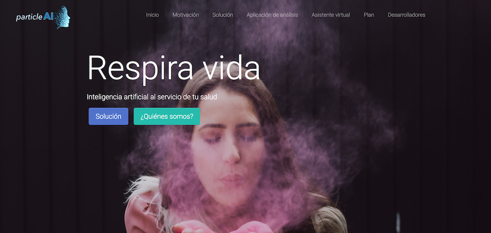

# ParticleAI 
Sistema de inteligencia artificial centralizado capaz de analizar, monitorizar y predecir el estado de las partículas en suspensión, polen y contaminación pasadas, presentes y futuras, con el objetivo de mejorar la calidad de vida de las personas. Más información en: http://users.dsic.upv.es/~flip/particleAI/ .

## Reto 

Con más de 24 millones de muertes al año y con un coste sanitario anual estimado  de $422.000 Millones, las enfermedades alérgicas son una de las principales enfermedades en el planeta,  donde más de un tercio de la población mundial presenta alguna enfermedad de origen alérgico. Un correcto análisis y control, así como la estimación temprana de todos aquellos factores que más afectan a las enfermedades alérgicas permitiría a los pacientes anticiparse a los síntomas y evitarlos en la medida de lo posible. 

## Solución 
Con este reto en mente, hemos desarrollado ParticleAI (www.dsic.upv.es/~flip/particleAI/), un sistema centralizado basado en modelos de Inteligencia Artificial, aprendizaje automático y tratamiento estadístico de datos capaz de analizar, monitorizar y predecir el estado de partículas en suspensión, polen y contaminación a partir de grandes cantidades de datos históricos (2009-2017) con el objetivo de mejorar la calidad de vida de las personas. El sistema se ha desarrollado con la ayuda de profesionales de la titulación de Ingeniería Agroalimentaria y del Medio Rural de UPV, para una mejor comprensión de la problemática, niveles y posibles alertas. A su vez, el sistema se retroalimenta de forma continua (diaria o semanalmente) de nuevos datos a partir de fuentes públicas, mejorando así la bondad de los modelos predictivos utilizados. La característica distintiva de ParticleAI es que ha sido implementado como módulo inteligente proveedor de datos y servicios, siendo el germen de desarrollo dos nuevas aplicaciones: 

- **Herramienta web multiplataforma y multiobjetivo** (https://safe-tools.dsic.upv.es/shiny/ParticleAI/): permite al usuario más avanzado obtener información tanto cuantitativa como cualitativa, histórica y futura, visual y textual de la evolución de las distintas partículas, así como de su comportamiento y dispersión. 

- **Asistente personal virtual para la red de mensajería de Telegram** (@ParticleAI): cuyo objetivo es el de  ayudar y alertar a los usuarios en cuestiones relacionadas con la estimación de niveles futuros de contaminantes, polen y partículas en suspensión. Es además posible atender requerimientos especiales de usuario debido a sus altas capacidades de personalización. 

## Plan futuro
Este desarrollo es el primer paso de un proyecto a corto y medio plazo cuyo objetivo final es el de obtener:

1. Un sistema centralizado robusto que permita trabajar en la prevención y diagnóstico de enfermedades alérgicas, centrándose en los agentes medioambientales que las causan.

2. Emprender actuaciones, dirigidas a los afectados, ayudándoles a superar las dificultades (transporte, planificación de actividades, alertas de actuación, etc) que les acarrea la alergia y enfermedades derivadas en su vida diaria.

2. Establecer líneas de cohesión con alergólogos, pacientes y demás profesionales de la materia, actuando ParticleAI como intermediario en un proceso de comunicación, colaboración mutua y mejora/aprendizaje incremental.
